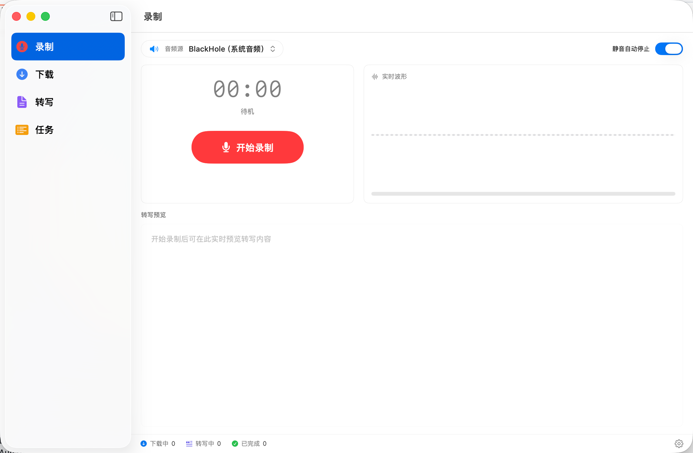
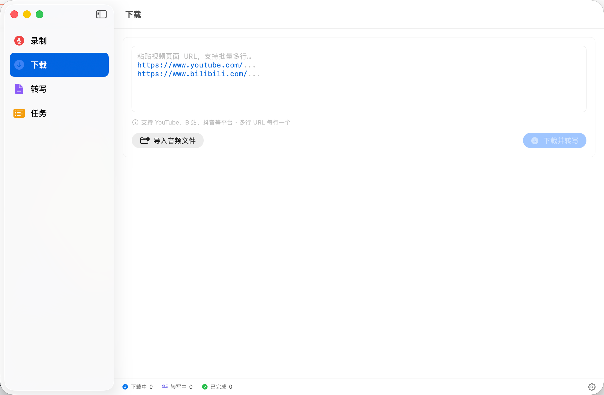
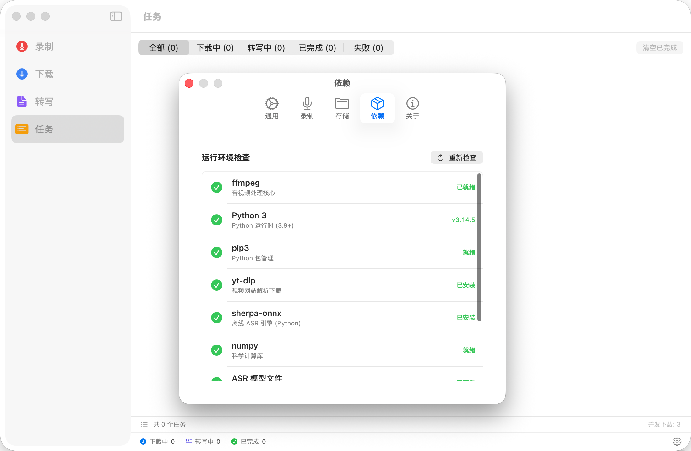

# AudioNote

> 一个 macOS 桌面应用，把「下载 → 录制 → 转写 → 笔记」做成一条流水线。
>
> Powered by SwiftUI · yt-dlp · Core Audio (AUHAL + BlackHole loopback) · sherpa-onnx (SenseVoice) · ffmpeg

---

## 💡 AudioNote × AI Agent 能解决什么问题

AudioNote 本身只做一件事：把声音变成文本。但当它和你身边的 AI Agent（WorkBuddy / Claude Code / Cursor 等）串起来之后，它会变成一个**「时间放大器」**——把你以前必须**坐在那里实时听**的内容，变成可以**异步处理、随时检索、一键分享**的结构化知识。

下面是几个真实使用场景：

### 🎯 场景 1：培训/分享直播时间冲突，让 app 替你"在场"

行业大牛的分享/培训直播经常和会议、跟孩子时间撞车，错过就只能等回放（甚至没有回放）。
- 在电脑上挂着直播页面，打开 AudioNote 录制系统音频（走 BlackHole loopback 抓内放，**直播平台不需要任何配合**）
- 直播结束后 AudioNote 自动转写出 txt
- Agent 检测到新文件 → 调用「直播分享总结」Skill → 输出**核心观点 + 金句 + 行动建议** 三段式笔记
- 你晚上下班回来直接读 5 分钟笔记，等于看完 2 小时直播

**收益**：把 2 小时的线性直播压缩成 5 分钟的可检索笔记，且全程不需要你坐在屏幕前。

### 🎯 场景 2：长播客/访谈视频，从 2 小时到 3 分钟摘要

B 站 / YouTube 上有大量 1–3 小时的优质访谈、播客、Podcast，听完成本高，但你又不想错过。
- 在 B 站找到访谈视频页 → 复制 URL 粘到 AudioNote 的下载框
- AudioNote 自动剥离音轨（**不下视频**，省 90% 空间）→ 转写
- Agent 调用「访谈摘要」Skill → 输出**人物观点 + 金句卡片 + 重要时间戳** + （可选）转成微博/朋友圈分享文案
- 你只看输出的 3 分钟摘要，命中兴趣点了再去看原视频对应段落

**收益**：信息消费效率提升 20–40 倍，且避免"以为听完了其实只记住开头"的伪学习。

### 🎯 场景 3：联动日历，会议自动录音 → 自动出纪要 → 自动同步到个人站点

把 AudioNote 接到 Apple 日历 / Outlook / 飞书日历的 Agent 上：
- 会议日程时间到 → Agent 自动调起 AudioNote 开始录制（系统音频 + 麦克风混音）
- 会议结束（日历事件 endTime 或检测到长时间静音）→ 自动停止录制并转写
- Agent 调用「会议纪要」Skill → 输出**议题 / 决议 / Action Items（带 owner + due date）/ 待跟进问题** 结构化纪要
- 纪要自动发布到**个人 OA Pages 站点 / Notion / 公司 wiki**，生成永久链接
- Agent 把链接通过企微/邮件**自动发给所有与会者**，附带一句"如有补充欢迎在评论区/wiki 上修订"

**收益**：会议结束的瞬间纪要就已经躺在会议群里了，告别"会后没人整理纪要 → 三天后所有人都忘了讨论了什么 → 决议无法落地"的死循环。

### 关键洞察：AudioNote 不"做总结"，但它让"总结"成为可能

行业里 ASR + LLM 一体的产品（飞书妙记、腾讯会议智能纪要）很好用，但有两个问题：① 数据上云，敏感内容不能用；② 总结模板写死，没法按你自己的语境和知识库定制。**AudioNote 走另一条路**：

- **声音→文本** 这一段 100% 本地（sherpa-onnx 离线推理），不上云
- **文本→结构化笔记** 这一段交给你**自己的 Agent + 自己的 Skill + 自己的知识库**，你想怎么总结就怎么总结
- 中间用一个**固定的目录**（文件名 `MMDDHHMMSS.txt`）做约定，谁都能接入

把这条管道接起来，你就有了一个**完全私有、完全可定制、随用随调** 的"声音→知识"流水线。

---

## ✨ 它能做什么

### 核心能力

- **🎬 从链接直接转写**：粘贴 B 站 / YouTube / 抖音 / 小红书 / 微博 URL → 自动下载音频 → 自动转写成 txt
- **🎙️ 系统音频录制**：通过 BlackHole 等虚拟声卡（loopback 设备）+ Core Audio AUHAL 抓系统输出，可同时混入麦克风；启动录制时自动把系统输出路由到「BlackHole + 耳机」多输出设备，不影响正常听音
- **📝 离线本地转写**：sherpa-onnx + SenseVoice 模型，全程本地推理，不上传任何数据
- **📂 本地文件导入**：mp3 / m4a / wav / mp4 拖进来即转写
- **🔁 断点续转**：转写过程实时把已完成段 flush 到 sidecar，异常中断后可自动从中断处继续，不用每次从头来
- **⏯️ 任务队列**：下载 / 录制 / 转写统一调度，全部支持暂停、继续、重试、取消、置顶
- **📊 双阶段计时**：下载进度 / 下载耗时 / 转写进度 / 转写耗时 / 进行中预估剩余时间，全程可见

### 🤖 与 Agent 联动（推荐玩法）

AudioNote 只做最稳的事 —— **把"声音"变成"文本"**，并把 txt 文件落到一个固定目录。**总结、提炼、整理** 这件事交给上层 Agent（[WorkBuddy](https://www.codebuddy.cn/workbuddy) / Claude Code / Cursor / 自建 LLM pipeline 都行），让 AudioNote 成为你 Agent 工作流的「音频入口」。

**典型联动方式**：在 WorkBuddy / 其它 Agent 里配置一个**定时任务**（cron / launchd / Agent 平台的 schedule），周期性扫描 AudioNote 的输出目录（默认 `~/Documents/AudioNote/Downloads/` 和 `~/Documents/AudioNote/Recordings/`，转写 `.txt` 与源音频同目录），发现新增 `.txt` 就触发一个**总结 Skill**，自动把这段录音/视频整理成结构化笔记。

**按场景写不同的总结 Skill**：

| 场景 | 输入 | Skill 产出 |
|---|---|---|
| 会议录音 | 会议系统音频 + 麦克风混音 | **会议纪要**：议题/决定/行动项（owner+deadline）/风险/待跟进 |
| 直播课程 / 技术分享 | B 站直播回放 URL / 录屏系统音频 | **课程笔记**：知识点大纲 / 重点代码片段 / 引用资料 / 习题 |
| 播客 / 人物访谈 | 播客 RSS / YouTube URL | **人物观点 + 金句卡片**：嘉宾立场 / 论据链 / 可引用金句 |
| 自言自语备忘 | 麦克风录制 | **TODO 提取**：把碎碎念里的待办、想法、灵感分类落到 PKM |

**ASR 准确率补偿**（重要）：

AudioNote 用的是 sherpa-onnx + SenseVoice 本地小模型，**离线、隐私 OK，但识别准确率约 85–92%**，专有名词、英文术语、人名、数字常有错。在 Skill 的 prompt 里**必须加事实校验约束**，否则错误会被 LLM 总结放大。建议至少包含这几条：

1. **不要直接复述 ASR 文本**：先做事实纠错——根据上下文推断专有名词、人名、技术术语的正确写法，可疑处标 `[?]` 而非编造
2. **挂载领域知识库**：把你常用的项目代号、同事英文名、技术栈词表、行业黑话喂给 LLM（WorkBuddy 的 PKM / Cursor 的 codebase / Claude 的 Project knowledge 都行），强制 Skill 在总结时引用这份知识库做校对
3. **数字 / 日期 / URL 二次校验**：金额、版本号、时间点这类强结构信息，Skill 要单独抽出来标记"低置信度，请人工确认"
4. **保留可追溯性**：总结里关键论断附带原文片段（行号/时间戳），方便回溯——这样即使 LLM 误读，也能快速发现

**示例：WorkBuddy 上配置定时扫描任务**（一句话指令）：

> *"每 10 分钟扫描一次 `~/Documents/AudioNote/Downloads/` 和 `~/Documents/AudioNote/Recordings/` ，对今天新增的 `.txt` 文件调用 `meeting-minutes` skill 生成纪要并归档到 PKM；处理过的文件在文件名追加 `.processed` 后缀避免重复处理"*

WorkBuddy 会自动把这条变成一个 RRULE 自动化跑起来。其它 Agent 平台同理，核心是「扫目录 → 去重 → 调 Skill → 归档」四步。

---

## 📸 截图

| 录制 | 下载 |
|---|---|
|  |  |

**依赖自检面板**：设置 → 依赖 一键检查 ffmpeg / Python / yt-dlp / sherpa-onnx / ASR 模型 是否齐全，缺什么点一键安装



---

## 🏗️ 架构

```
┌────────────────────────────────────────────────────────────┐
│                       SwiftUI UI 层                        │
│   RecordView · DownloadView · TaskQueueView · Transcript   │
└─────────────────────────┬──────────────────────────────────┘
                          │
┌─────────────────────────▼──────────────────────────────────┐
│                    Orchestration 编排层                    │
│   TaskScheduler（并发调度 / 优先级 / 持久化）              │
│   UnifiedPipeline（download → extract → transcribe 串联）  │
└─────────────────────────┬──────────────────────────────────┘
                          │
┌─────────────────────────▼──────────────────────────────────┐
│                       Engine 引擎层                        │
│   DownloadEngine     ── yt-dlp 子进程 + 站点 headers      │
│   AudioCaptureEngine ── Core Audio AUHAL + BlackHole      │
│   AudioProcessingEngine ── ffmpeg 转码 / 混音             │
│   ASRService         ── transcribe.py + sherpa-onnx       │
└─────────────────────────┬──────────────────────────────────┘
                          │
┌─────────────────────────▼──────────────────────────────────┐
│                      外部二进制 / 模型                     │
│   ffmpeg (vendor)  ·  yt-dlp (pip / brew)  ·  Python venv │
│   sherpa-onnx OfflineRecognizer (SenseVoice CTC)          │
└────────────────────────────────────────────────────────────┘
```

详细架构和数据流见 [ARCHITECTURE.md](./ARCHITECTURE.md)。

---

## 📁 目录结构

```
AudioNote/                         # 工程根（GitHub 仓库名 audio-note）
├── Package.swift                  # SwiftPM manifest（macOS 13+，executable target AudioNote）
├── README.md                      # 本文件
├── ARCHITECTURE.md                # 架构 / 数据流 / 关键设计决策
├── DEVELOPMENT.md                 # 开发指南：环境准备 / 构建 / 调试 / 打包
├── LICENSE                        # MIT
├── Sources/
│   ├── App/
│   │   └── AudioNoteApp.swift     # @main 入口、Scene 配置、Settings link
│   ├── Bridge/
│   │   └── BinaryResolver.swift   # 4 级二进制定位：bundle → vendor → PATH → which
│   ├── Core/
│   │   └── DependencyManager.swift# Python venv / pip 包 / ffmpeg / 模型 检测与一键安装
│   ├── Engine/                    # 业务引擎（每个引擎单文件，互不依赖）
│   │   ├── DownloadEngine.swift   # yt-dlp 调度、进度流式解析、错误归一
│   │   ├── AudioCaptureEngine.swift # Core Audio AUHAL 绑 BlackHole loopback + 麦克风混音
│   │   ├── AudioProcessingEngine.swift # ffmpeg 转码、混音、采样率归一
│   │   ├── OutputDeviceRouter.swift # CoreAudio 输出路由
│   │   └── ASRService.swift       # 调用 transcribe.py、sidecar 断点续转
│   ├── Logging/
│   │   └── Logger.swift           # 统一日志（os.Logger + 文件落盘）
│   ├── Models/
│   │   └── Models.swift           # UniTask / TaskStatus / TaskSnapshot 等核心类型
│   ├── Orchestration/
│   │   ├── TaskScheduler.swift    # @MainActor 全局调度器，统一编排所有任务
│   │   └── UnifiedPipeline.swift  # download → extract → transcribe 串联
│   └── UI/
│       ├── DesignTokens.swift     # 颜色 / 间距 / 字号 设计令牌
│       ├── RootView.swift         # NavigationSplitView + sidebar tabs
│       ├── Record/                # 录制视图（波形 / 计时器 / 实时预览）
│       ├── Download/              # 下载视图（URL 输入 + 选项）
│       ├── Queue/                 # 任务队列视图（操作按钮 / 双阶段进度）
│       ├── Transcript/            # 笔记视图（txt 浏览 / 检索）
│       └── Settings/              # 设置（路径 / 模型 / 网络 / 诊断）
├── Tests/                         # 单测（最小骨架）
├── scripts/
│   ├── transcribe.py              # sherpa-onnx 推理脚本，支持 --partial-file 增量 flush
│   └── fetch_vendor.sh            # 首次构建拉取 ffmpeg 静态二进制（48MB，不入 git）
└── vendor/                        # 外部二进制本地缓存（git 忽略）
    └── ffmpeg                     # arm64 静态构建（运行 fetch_vendor.sh 自动获取）
```

---

## 🚀 快速开始

### 前置依赖

| 项 | 版本 | 用途 |
|---|---|---|
| macOS | 13.0+ | SwiftUI / Core Audio |
| BlackHole (2ch) | 0.5+ | 系统音频 loopback（录制系统输出必装；不录制系统音频可不装） |
| Xcode CLT | 15+ | Swift 5.9 toolchain |
| Python | 3.10–3.12 | sherpa-onnx 推理 |
| ffmpeg | 6.0+ | 音视频转码（首次构建自动下载） |

### 编译与运行

```bash
# 克隆
git clone https://github.com/fanbaocheng/audio-note.git
cd audio-note

# 拉 ffmpeg 二进制（48MB，arm64 静态构建，不入 git）
bash scripts/fetch_vendor.sh

# 如需录制系统音频，安装 BlackHole（虚拟声卡，做 loopback 用）
brew install blackhole-2ch
# 装完后在「音频 MIDI 设置」里创建一个「多输出设备」，勾选 BlackHole 2ch + 你的耳机/扬声器

# 编译运行（开发态）
swift run -c release
```

**首次启动**：打开 App → 进入「设置 → 依赖」面板，按提示**一键安装**剩余依赖：

- Python venv（创建在 `~/Library/Application Support/AudioNote/python-venv/`）
- pip 包（`sherpa-onnx` / `numpy` / `yt-dlp`）
- ASR 模型（`sherpa-onnx-sense-voice-zh-en-ja-ko-yue-2024-07-17`，约 240MB，下载到 `~/.cache/sherpa-onnx-models/`）

所有依赖**装在用户目录下，不污染系统 Python**，卸载只需删对应目录。

> 如果偏好手动安装，参见 [DEVELOPMENT.md → 手动安装依赖](./DEVELOPMENT.md#手动安装依赖)。

### 打包 .app（分发）

```bash
bash scripts/make_app.sh
# 产出 build/AudioNote.app，可直接拷贝到 /Applications/ 或桌面
# 默认 release 配置；想要 debug 用：bash scripts/make_app.sh debug
```

---

## 🔑 关键设计决策

### 1. 下载和转写解耦
下载持久化格式是 **mp3（~150kbps，压缩）**，转写时由 ASRService 临时 ffmpeg 转 16k mono PCM wav 喂给 transcribe.py，转完即删。这样 2.5 小时视频下载下来 ~200MB，而不是无压缩 wav 的 1.85GB。

### 2. 断点续转 sidecar
转写脚本每完成一段（默认 20s 窗口）立即 `_append_partial` → `<basename>.partial.tsv`，open append + flush + `os.fsync(fileno)` 强制刷盘。静音段也写空 text 占位。Swift 启动转写前读 sidecar 拿到 `(priorText, resumeFromSegment)`，把 `--partial-file` + `--resume-from-segment` 透传给脚本，从中断点继续。最终 .txt 写入后清理 sidecar。

### 3. 任务模型统一
下载、录制、导入、转写不分别管理，统一为 `UniTask`，由单一 `TaskScheduler` 调度。每个 task 跟踪 download/transcribe 两个阶段的 `startedAt/finishedAt`，并对外暴露 `elapsedSeconds` / `estimatedRemainingSeconds` 计算字段。

### 4. 文件命名 + 默认目录统一
- **命名规则**：下载音频、录制音频、转写 txt 文件名统一为 `MMDDHHMMSS.xxx`（10 位时间戳，本地时区），便于排序和与笔记关联。导入文件不重命名（保留原始名）。
- **默认目录**：
  - 下载：`~/Documents/AudioNote/Downloads/`
  - 录制：`~/Documents/AudioNote/Recordings/`
  - 转写 `.txt`：**与源音频同目录**（不单独放 transcripts/，避免多一份目录约定）
  - ASR 模型：`~/.cache/sherpa-onnx-models/sherpa-onnx-sense-voice-zh-en-ja-ko-yue-2024-07-17/`
  - Python venv：`~/Library/Application Support/AudioNote/python-venv/`
- 所有目录都可在「设置」里改。

### 5. 二进制 4 级回退
`BinaryResolver` 按顺序探测：
1. `.app/Contents/Resources/vendor/<bin>`（打包态）
2. `<workspace>/vendor/<bin>`（开发态）
3. `$PATH`
4. `which <bin>`

让开发态和打包态用同一份代码，不需要 #if DEBUG 分支。

---

## 📜 License

MIT © 2026 ryan
